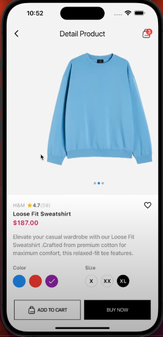

# Flutter E-Commerce App UI Design 

---

## Features

- **Responsive Design**: Adapts to various screen sizes and orientations.
- **Modern UI Components**: Beautiful and intuitive design elements tailored for e-commerce.
- **Interactive Elements**: Buttons, cards, and lists optimized for user engagement.
- **Custom Widgets**: Reusable components for clean and maintainable code.

---
## Screenshots

### 

### 

### 

